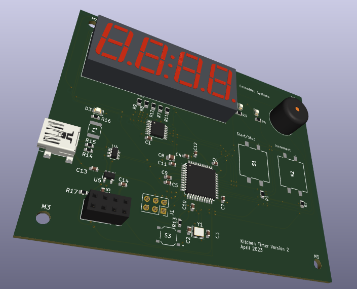

Kitchen Timer: Embedded Systems Project

Cade Thornton

10/23/2023

Embedded Systems

## Table of Contents

-------

+ [Introduction](#Introduction )
+ [PCB Design in KiCad](#PCBDesigninKiCad)
    * [Schematic](#Schematic)
    * [Layout](#Layout)

+ [Arduino Code](#ArduinoCode)
    * [Overview](#Overview)

+ [Conclusion](#Conclusion)

## Introduction 

-------

The goal of this project is to create a PCB schematic and layout for a simple kitchen timer made using the AT-mega microprocessor, the Arduino IDE, and KiCad.

  

  

    Figure 1 (Completed PCB board setup)
  

## PCB design in KiCad

### Schematic

 
The schematic for this design included roughly nine modules that work fit together to make the full system.

  

  

    Figure x (image caption)
  

### Layout 

------

## Arduino Code

-------

## Conclusion

------

